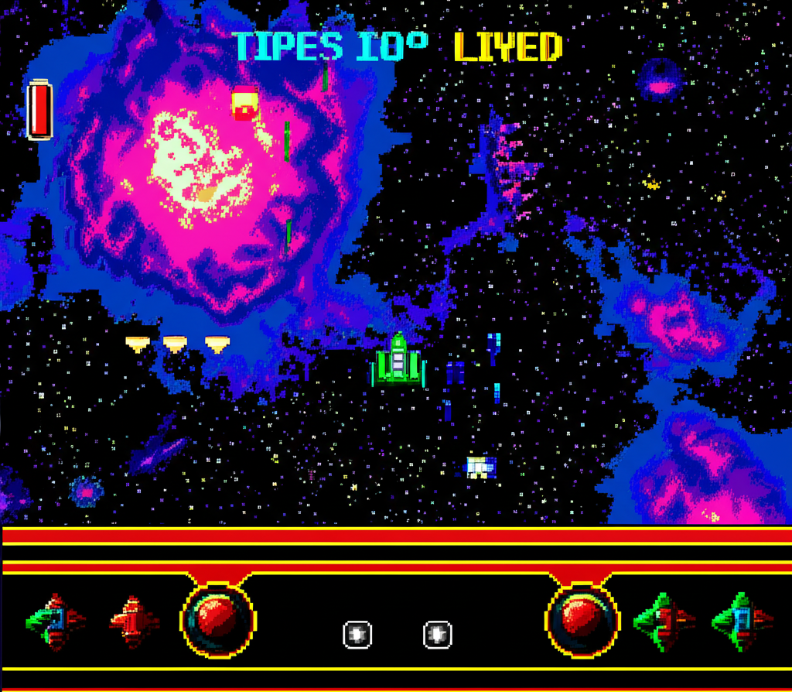

# 🎮 YouTube Downloader - 80's Arcade Style

> **Your Gateway to the Media Mainframe**

A sleek, retro-cyberpunk YouTube downloader with authentic 80's arcade aesthetics, featuring Matrix rain effects and terminal-style UI. Download YouTube videos in multiple qualities with a nostalgic cyberpunk interface.



🌐 **Live Demo**: [https://vid-vault-youtube-downloader-production.up.railway.app](https://vid-vault-youtube-downloader-production.up.railway.app)

## ✨ Features

🌧️ **Matrix Rain Animation** - Live falling character effect with Japanese katakana, Latin letters, and numbers  
🎯 **Retro Terminal UI** - VT323 font with authentic green-on-black cyberpunk styling  
💎 **Glass Morphism** - Modern blur effects with neon glowing borders  
📱 **Responsive Design** - Perfect on desktop, tablet, and mobile with proper margins  
⚡ **Multiple Quality Options** - Download in 1080p, 720p, 480p, or 360p  
🎨 **Modern Architecture** - Built with Next.js 15, TypeScript, and shadcn/ui components  

## 🚀 Getting Started

This is a fully functional YouTube video downloader that allows you to download videos in multiple qualities.

**How to use:**
1. Enter any YouTube URL (e.g., `https://www.youtube.com/watch?v=dQw4w9WgXcQ`)
2. Click "RE-SCAN" to analyze the video
3. View video details including title, duration, and available qualities
4. Select your preferred quality (1080p, 720p, 480p, or 360p)
5. Click "DOWNLOAD" to save the video to your device

## 🛠️ Tech Stack

- **Framework**: Next.js 15.2.4
- **Language**: TypeScript
- **Styling**: Tailwind CSS
- **UI Components**: shadcn/ui
- **Fonts**: VT323 (Google Fonts)
- **Animation**: Custom Canvas Matrix Rain
- **Icons**: Lucide React

## 📦 Installation

1. **Clone the repository**
   ```bash
   git clone https://github.com/cjsbass/vid-vault-youtube-downloader.git
   cd vid-vault-youtube-downloader
   ```

2. **Install dependencies**
   ```bash
   npm install --legacy-peer-deps
   ```

3. **Start the development server**
   ```bash
   npm run dev
   ```

4. **Open your browser**
   Navigate to `http://localhost:3000`

## 🚨 Important Note on Deployment

When deploying to cloud services like Railway, Heroku, or similar platforms, YouTube may block requests with "Sign in to confirm you're not a bot" errors. This is because YouTube detects requests from data center IPs as potential bots.

**Solutions:**
1. **Run locally** - The app works perfectly when run on your local machine
2. **Use a residential proxy** - Configure yt-dlp to use residential proxies
3. **Self-host on a VPS with residential IP** - Use services that provide residential IPs
4. **Add cookies** - Export cookies from your browser and configure yt-dlp to use them

For production deployments, consider implementing a queue system where users submit URLs and downloads are processed from a residential IP.

## 🎯 Usage

1. **Enter YouTube URL**: Paste any valid YouTube URL into the terminal input
2. **Execute Analysis**: Click the "EXECUTE" button to analyze the video
3. **Choose Quality**: Select from available resolution options (1080p, 720p, 480p, 360p)
4. **Download**: Click "DOWNLOAD" for your preferred quality

## 🎨 Design Philosophy

CorgnelliTube combines modern web development practices with nostalgic 80's arcade aesthetics:

- **Cyberpunk Theme**: Dark backgrounds with neon green accents
- **Terminal Interface**: Monospace fonts and command-line styling
- **Matrix Effects**: Animated falling characters for immersive experience
- **Glass Morphism**: Contemporary blur effects maintaining the retro vibe
- **Responsive Layout**: Ensures great experience across all devices

## 📁 Project Structure

```
corgnellitube-youtube-downloader/
├── app/
│   ├── globals.css          # Global styles and animations
│   ├── layout.tsx           # Root layout component
│   └── page.tsx             # Main application page
├── components/
│   ├── matrix-rain.tsx      # Matrix rain animation component
│   ├── theme-provider.tsx   # Theme context provider
│   └── ui/                  # shadcn/ui components
├── public/
│   ├── 80s-arcade-screenshot.png
│   └── cyberpunk-thumbnail.png
└── styles/
    └── globals.css          # Additional global styles
```

## 🔧 Development

```bash
# Development server
npm run dev

# Build for production
npm run build

# Start production server
npm start

# Lint code
npm run lint
```

## 🎮 Features in Detail

### Matrix Rain Effect
- Real-time canvas animation
- Japanese katakana, Latin letters, and numbers
- Responsive to window resizing
- Optimized performance with RAF

### 80's Arcade Styling
- VT323 retro terminal font
- Neon green color scheme (#00ffff, #ff00ff, #ffff00)
- Glowing text shadows and borders
- Terminal-style command prompts

### Modern UI Components
- Fully accessible shadcn/ui components
- Glass morphism card designs
- Smooth hover animations
- Loading states and transitions

### Backend Features
- **yt-dlp Integration** - Uses the powerful yt-dlp library for video extraction
- **Multiple Quality Support** - Automatically detects and offers available video qualities
- **Stream Downloads** - Efficient streaming downloads without storing files on server
- **Error Handling** - Comprehensive error handling and user feedback

## 🤝 Contributing

1. Fork the repository
2. Create your feature branch (`git checkout -b feature/amazing-feature`)
3. Commit your changes (`git commit -m 'Add amazing feature'`)
4. Push to the branch (`git push origin feature/amazing-feature`)
5. Open a Pull Request

## 📄 License

This project is open source and available under the [MIT License](LICENSE).

## 🎯 Roadmap

- [ ] Real YouTube API integration
- [ ] Additional video formats (MP3, WebM)
- [ ] Playlist download support
- [ ] Download progress indicators
- [ ] User preferences storage
- [ ] PWA support

## 🙏 Acknowledgments

- **shadcn/ui** for the beautiful component library
- **Next.js** team for the amazing framework
- **Tailwind CSS** for utility-first styling
- **Lucide** for the clean icons
- **80's aesthetic** inspiration from retro computing and cyberpunk culture

---

<div align="center">
  <strong>🎮 Ready to extract videos from the matrix? 🎮</strong>
  <br />
  <br />
  Made with ❤️ and 80's nostalgia
</div>